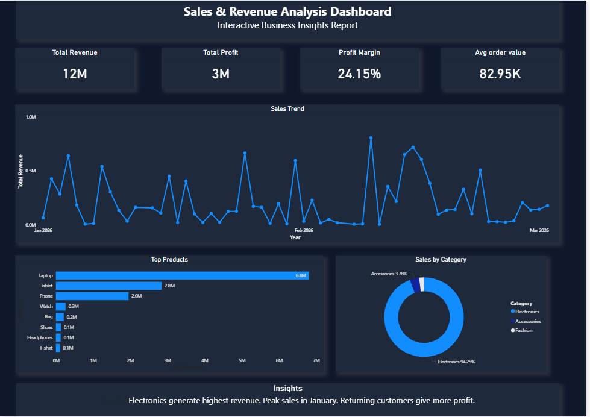

#  Sales & Revenue Dashboard (Power BI)

##  Overview
This project is an interactive Sales & Revenue dashboard built using Power BI to analyze business performance.

##  Features
- KPI Cards: Revenue, Profit, Profit Margin, Avg Order Value
- Sales Trend Analysis (Line Chart)
- Top Products (Bar Chart)
- Category-wise Distribution (Donut Chart)

##  Insights
- Electronics generate highest revenue
- Peak sales observed in January
- High profit from returning customers

##  Tools Used
- Power BI
- Data Visualization
- DAX

##  Dashboard Preview

